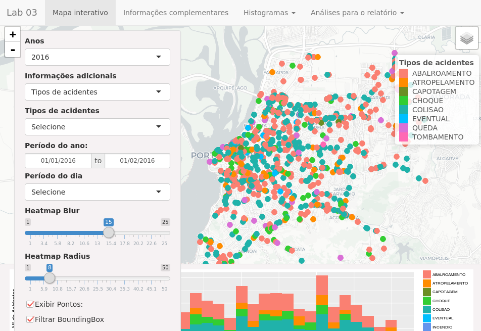
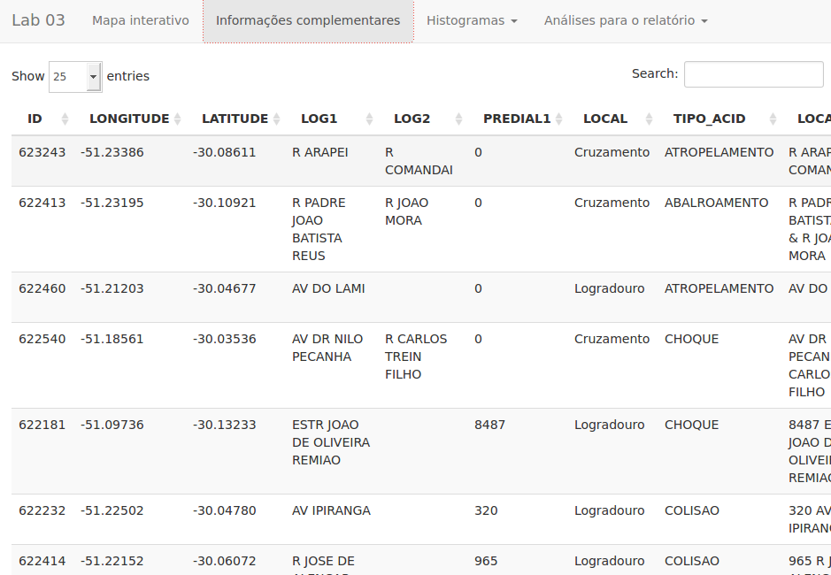
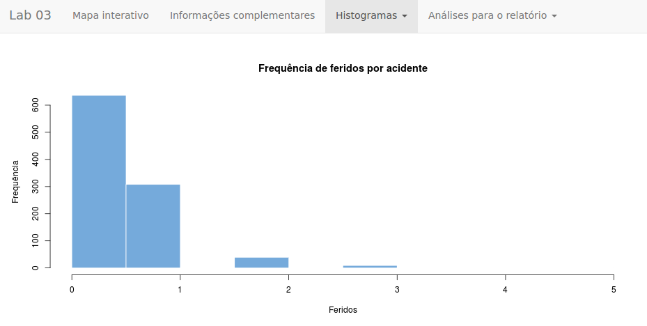
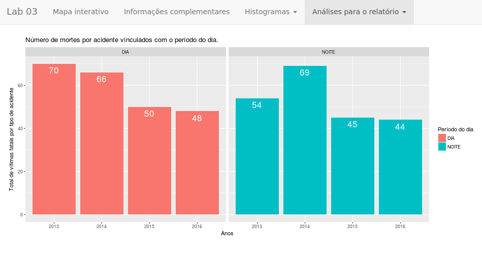

# Traffic Accidents in Porto Alegre
This repository presents the final work of Data Visualization of the Big Data &amp; Data Science course of the Institute of Informatics of UFRGS.

Site: <a href="https://murillo.shinyapps.io/Lab03/" target="_blank" >https://murillo.shinyapps.io/Lab03/</a>

## View of the city of Porto Alegre, Brazil

## Tabbed data

## Histogram display

## Analyzes

## Libraries used in application Shiny
* RCurl
* tidyverse
* shiny
* leaflet
* leaflet.extras
* RColorBrewer
* ggplot2
* rsconnect